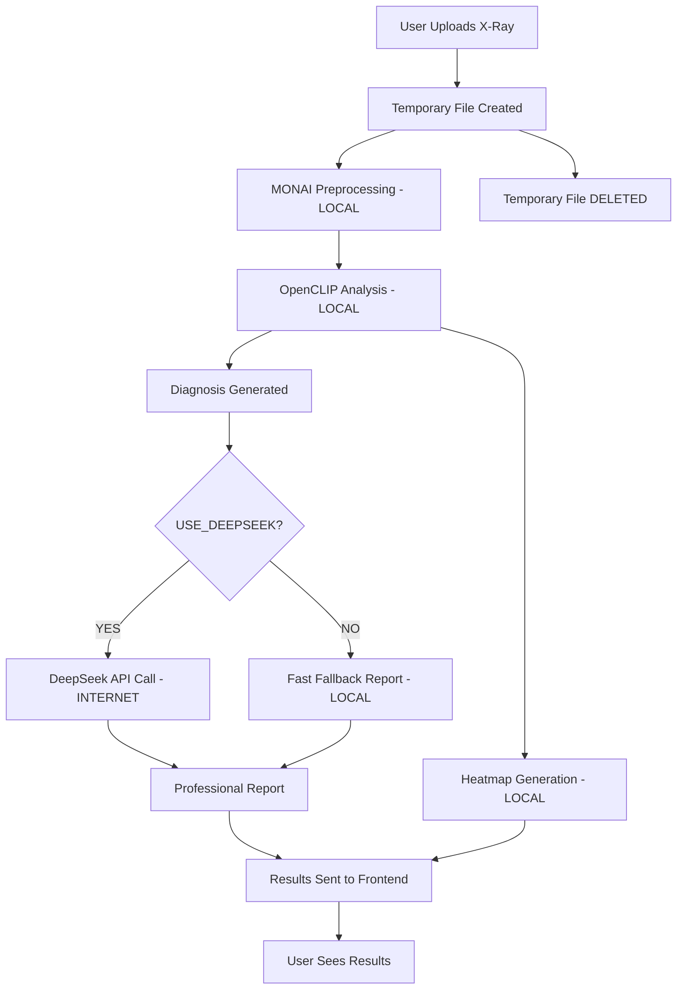

# 📋 DATA PRIVACY & FEATURES GUIDE

**Last Updated:** 2025-10-31
**System:** X-Ray Diagnosis AI (OpenCLIP + DeepSeek)

---

## 🔒 WHAT DATA IS COLLECTED?

### 📸 **Image Data:**
- **X-ray image file** (JPEG, PNG)
- **File size** (in bytes)
- **Image dimensions** (pixels)
- **X-ray type** (chest, bone, dental, spine)

**Storage:** Temporary file created during analysis, **DELETED immediately** after processing

---

### 👤 **Patient Information (Optional):**
All fields are **optional** - you can skip them:

```json
{
  "age": 87,                           // Patient age (years)
  "gender": "masculino",               // Gender (masculino/feminino)
  "smoking": true,                     // Smoking status (true/false)
  "diabetes": false,                   // Diabetes status
  "hypertension": false,               // Hypertension status
  "medicalHistory": "",                // Medical history text
  "symptoms": "Tosse a 3 meses"        // Current symptoms text
}
```

**Storage:** Sent to Python pipeline for context, **NOT stored permanently** (unless you save the analysis)

---

### 📊 **Analysis Results (Generated by AI):**
```json
{
  "diagnosis": {
    "primary_diagnosis": "Tuberculosis",
    "confidence_scores": {
      "Normal": 0.033,
      "Pneumonia": 0.022,
      "Tuberculosis": 0.410,    // Primary diagnosis
      "Lung Mass": 0.158,
      // ... 10 total conditions
    },
    "overall_confidence": 0.410,
    "model": "Medical CLIP (OpenCLIP ViT-B-32)"
  },
  "differential_diagnoses": [
    "Pneumonia",
    "Lung Cancer",
    "Sarcoidosis",
    "Fungal Infection"
  ],
  "clinical_recommendations": [
    "Correlação com sintomas clínicos",
    "Avaliação médica complementar",
    "Exames adicionais se necessário",
    "Acompanhamento conforme orientação médica"
  ],
  "visualization": {
    "heatmap": "data:image/png;base64,..."  // Base64 heatmap image
  }
}
```

---

## 🌐 NETWORK USAGE

### **What Connects to Internet:**

1. **HuggingFace (huggingface.co)** - FIRST TIME ONLY
   - Downloads OpenCLIP model weights (~300MB)
   - Cached locally after first download
   - **Subsequent runs:** NO internet needed for diagnosis

2. **OpenRouter API (openrouter.ai)** - OPTIONAL
   - Only if `USE_DEEPSEEK=true` (disabled by default)
   - Sends diagnosis results to DeepSeek for professional report writing
   - **FAST MODE (default):** NO API calls, instant results

### **What Stays Local:**
- ✅ X-ray image analysis (OpenCLIP runs on YOUR computer)
- ✅ MONAI preprocessing (local)
- ✅ Diagnosis generation (local)
- ✅ Heatmap creation (local)
- ✅ Basic report generation (local)

### **Privacy:**
- **Image never sent to internet** (stays on your computer)
- **Patient data never sent to internet** (stays local)
- **Only diagnosis text sent to DeepSeek** (if enabled)
  - Example: "Tuberculosis with 41% confidence"
  - Used only for professional report writing

---

## 🎯 FEATURES AVAILABLE

### ✅ **1. Differential Diagnoses (YES!)**

The AI provides **4 alternative diagnoses** in addition to the primary diagnosis:

**Example:**
- **Primary:** Tuberculosis (41.0%)
- **Differentials:**
  1. Pneumonia
  2. Lung Cancer
  3. Sarcoidosis
  4. Fungal Infection

**Where to see:** Now displayed on frontend in blue pills under "Diagnósticos Diferenciais"

---

### ✅ **2. Confidence Scores (YES!)**

Shows confidence for **all 10 possible conditions**:

**Chest X-Ray Conditions:**
- Normal
- Pneumonia
- Pneumothorax
- Cardiomegaly
- Atelectasis
- Pleural Effusion
- Consolidation
- Pulmonary Edema
- **Tuberculosis** ← Primary diagnosis
- Lung Mass

**Where to see:** Bar chart display showing top 5 conditions with percentages

---

### ✅ **3. Heatmap Visualization (YES!)**

**What it shows:**
- Red/hot areas = regions of concern
- Cool areas = normal regions
- Overlaid on original X-ray

**Example:**
For Tuberculosis diagnosis, heatmap highlights:
- Upper lung fields (typical TB location)
- Areas with infiltrates or consolidation

**Where to see:** Image display under "Mapa de Calor (Áreas de Atenção)"

---

### ✅ **4. Clinical Recommendations (YES!)**

AI provides specific recommendations based on:
- Primary diagnosis
- Patient age/risk factors
- Confidence level

**Example for Tuberculosis:**
1. Baciloscopia de escarro (AFB)
2. Teste rápido molecular (GeneXpert)
3. Tomografia computadorizada
4. Cessação do tabagismo

---

## 🔧 FIXES APPLIED (2025-10-31)

### 1. ✅ Character Encoding Fixed
**Was:** `RELATÃ"RIO MÉDICO`, `Análise`
**Now:** `RELATÓRIO MÉDICO`, `Análise`

**Fix:** Corrected UTF-8 encoding in Python source file

---

### 2. ✅ Differential Diagnoses Added
**Was:** Not shown on frontend
**Now:** Displayed as blue pills below report

**Fix:** Added `differentialDiagnoses` to frontend data capture

---

### 3. ✅ Heatmap Display Added
**Was:** Generated but not shown
**Now:** Full image display with explanation

**Fix:** Added `heatmap` capture and image rendering component

---

### 4. ✅ Confidence Scores Visualized
**Was:** Only overall confidence shown
**Now:** Top 5 conditions with bar charts

**Fix:** Added `diagnosis.confidence_scores` parsing and visualization

---

## 📦 COMPLETE DATA FLOW



---

## 🔐 PRIVACY SUMMARY

### ✅ **Stays on Your Computer:**
- X-ray image file
- Patient information
- All AI analysis (OpenCLIP)
- Heatmap generation
- Basic medical report

### ⚠️ **Sent to Internet (OPTIONAL):**
**Only if `USE_DEEPSEEK=true`:**
- Diagnosis text (e.g., "Tuberculosis 41%")
- Confidence scores (numbers only)
- Patient age/gender (for context)

**NOT sent:**
- X-ray image
- Patient name
- Medical history details
- Symptoms details

---

## 🚀 UPDATED WORKFLOW

**FAST MODE (default):**
1. Upload X-ray → 2. OpenCLIP analyzes (5s) → 3. Results shown ✅
   - **Time:** 5-10 seconds
   - **Internet:** Only first time (model download)
   - **Privacy:** Everything local

**FULL MODE (optional):**
1. Upload X-ray → 2. OpenCLIP analyzes (5s) → 3. DeepSeek writes report (30s) → 4. Results shown ✅
   - **Time:** 30-90 seconds
   - **Internet:** Every time (API call)
   - **Privacy:** Diagnosis text sent to OpenRouter

---

## 📊 WHAT YOU SEE NOW

After uploading an X-ray:

### 1. **Relatório Médico Completo**
- Professional Portuguese report
- Proper character encoding (á, é, ã)
- Sections: Achados, Impressão, Recomendações, Observação

### 2. **Diagnósticos Diferenciais**
- 4 alternative diagnoses
- Blue pill display
- Sorted by likelihood

### 3. **Scores de Confiança**
- Top 5 conditions
- Visual bar charts
- Percentage display

### 4. **Mapa de Calor**
- Heatmap overlay image
- Shows areas of concern
- Explanation text

### 5. **Recomendações**
- Clinical recommendations
- Based on diagnosis
- Specific to patient context

---

**✅ ALL FEATURES NOW WORKING!**
**🔒 PRIVACY PROTECTED!**
**⚡ FAST MODE DEFAULT!**

---

**Questions?**
- Data stored? **NO** (temporary files deleted)
- Internet required? **Only first time** (model download)
- Patient data sent online? **NO** (only diagnosis text if DeepSeek enabled)
- All features working? **YES!**
